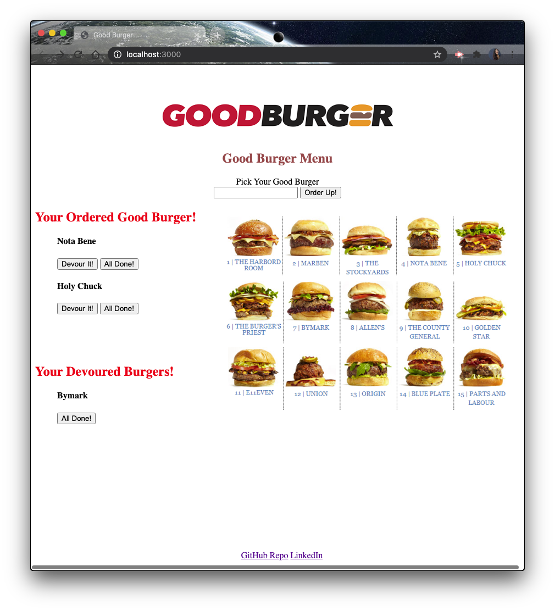

# burger_

## Description

 Good Burger logger with MySQL, Node, Express, Handlebars and a homemade ORM. You can type in a burger from the menu, add it, and then devour it.

Good Burger is an application which allows users to input the names of burgers they'd like to eat from the menu.

When the user submits a burger's name, the application will display the burger on the left side of the page while it waits to be devoured.

Good Burger stores every burger in a database.

